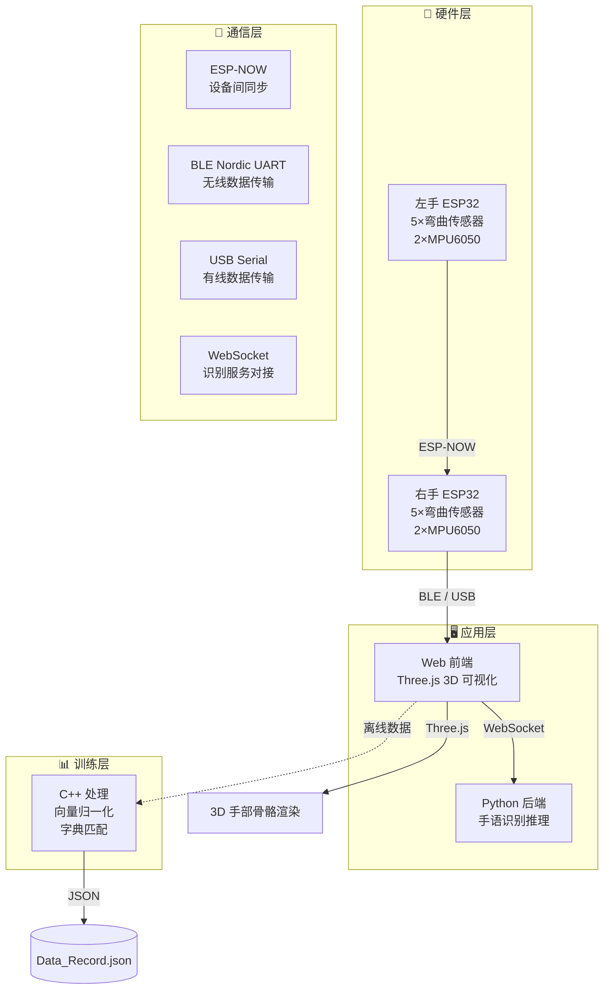
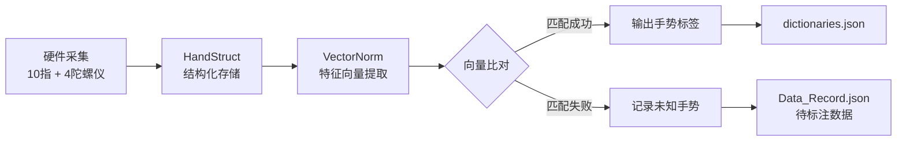

# 🖐️ Sign Language Recognition Gloves — 手语识别手套

> 基于 **柔性弯曲传感器 + MPU6050 陀螺仪** 的双手机电一体化手语识别系统。  
> 采集双手十指弯曲度与手腕/小臂姿态数据，通过 C++ 进行向量归一化与手势分类，  
> 前端基于 Three.js 实现 **3D 实时手部骨骼姿态可视化**。

<p align="center">
  
  
  
  
</p>

---

## 📑 目录

- [项目结构](#-项目结构)
- [系统架构](#-系统架构)
- [硬件组成](#-硬件组成)
- [快速开始](#-快速开始)
- [通信协议](#-通信协议)
- [前端功能](#-前端功能)
- [数据处理流程](#-数据处理流程)
- [技术栈](#-技术栈)
- [开发路线](#-开发路线)

---

## 📁 项目结构

```
Sign_Language_Recognition_Gloves/
│
├── Web/                          # 🌐 前端 3D 可视化 + 通信层
│   ├── index.html                #    入口页面
│   ├── main.js                   #    Three.js 场景、模型加载、骨骼动画驱动
│   ├── serial.js                 #    Web Serial / Web Bluetooth 通信与数据解析
│   ├── websocket_client.js       #    WebSocket 识别结果展示
│   ├── style.css                 #    全局 UI 样式
│   ├── package.json              #    Vite + Three.js + GSAP + Tweakpane
│   ├── temp_patch.txt            #    临时补丁记录
│   ├── public/                   #    静态资源 (GLB 模型等)
│   └── device/
│       └── right/right.ino       #    右手设备固件 (ESP-NOW 主机 + BLE 透传)
│
├── Cpp/                          # ⚙️ C++ 数据处理与手势训练
│   ├── main.cpp                  #    程序入口
│   ├── CMakeLists.txt            #    CMake 构建配置 (C++20)
│   ├── h/
│   │   ├── HandStruct.h          #    双手手势数据结构体 (10指 + 4轴陀螺仪)
│   │   ├── VectorNorm.h          #    向量归一化、特征提取与 JSON 输出
│   │   └── Data_input.h          #    交互式数据录入工具
│   └── source/
│       ├── Data_Record.json      #    训练数据记录
│       └── dictionaries.json     #    手势字典 (标签 → 特征向量映射)
│
├── wlw/                          # 🔧 Arduino 嵌入式固件与测试工具
│   ├── left/left.ino             #    左手设备固件 (ESP-NOW 从机)
│   ├── right/righthand-buletooth #    右手蓝牙版本代码
│   ├── MPU6050TEST.ino           #    MPU6050 独立测试程序
│   ├── 快速采样/                  #    快速 ADC 采样验证
│   ├── 划分代码/                  #    弯曲传感器档位划分算法
│   ├── base V/                   #    基准电压采集与标定
│   └── 蓝牙/                     #    蓝牙 Web 前端 (独立测试)
│       ├── index.html
│       ├── main.js
│       ├── serial.js
│       ├── websocket_client.js
│       ├── bluetooth.js
│       ├── style.css
│       ├── package.json
│       └── README.md
│
└── README.md                     # 📖 本文件
```

---

## 🏗️ 系统架构



### 数据流向说明

| 环节 | 方向 | 协议 | 说明 |
|------|------|------|------|
| 左手 → 右手 | 单向 | ESP-NOW | 左手传感器数据同步到右手主机 |
| 右手 → 前端 | 单向 | BLE / USB Serial | 双手融合数据 JSON 实时传输 |
| 前端 → 后端 | 双向 | WebSocket | 发送特征数据，接收识别结果 |
| 前端 → 渲染 | 内部 | Three.js API | 数据驱动 3D 手部骨骼动画 |

---

## 🔧 硬件组成

### 核心组件

| 组件 | 数量 | 用途 |
|------|:--:|------|
| **ESP32-S3 开发板** | 2 | 主控芯片，负责数据采集、融合与通信 |
| **柔性弯曲传感器** | 10 | 每指一个，检测手指弯曲角度 (0~90°) |
| **MPU6050 六轴陀螺仪** | 4 | 每手 2 个，分别检测手腕与小臂姿态 |
| **分压电阻** | 10 | 与弯曲传感器组成分压电路，供 ADC 读取 |
| **锂电池** | 2 | 分别为左右手设备供电 |

### 传感器数据规范

```
┌─────────────────────────────────────────────────────┐
│  手指弯曲值：0.000 (完全伸直)  ←→  1.000 (完全弯曲)   │
│  档位划分：  0 (0~20%)  1 (20~40%)  2 (40~60%)      │
│              3 (60~80%)  4 (80~100%)                │
│                                                     │
│  手腕姿态：  -0.4 ~ 0.4 (MPU6050 互补滤波融合角度)    │
│  小臂姿态：  -0.4 ~ 0.4                              │
└─────────────────────────────────────────────────────┘
```

### 硬件接线参考

| ESP32-S3 引脚 | 连接组件 | 说明 |
|:---:|------|------|
| 14, 10, 18, 7, 4 | 右手弯曲传感器 | 拇指→小指 |
| 8 (SDA), 9 (SCL) | MPU6050 ×2 | I2C 总线 (400kHz) |
| 对应左手引脚 | 左手弯曲传感器 | 左手 ESP32 独立连接 |

---

## 🚀 快速开始

### 环境要求

| 工具 | 版本要求 |
|------|---------|
| **Node.js** | ≥ 16.x |
| **浏览器** | Chrome / Edge (需 Web Serial/Bluetooth API) |
| **CMake** | ≥ 3.16 |
| **C++ 编译器** | 支持 C++20 (GCC ≥ 11 / Clang ≥ 14 / MSVC 2022) |
| **Arduino IDE** | ≥ 2.0 (含 ESP32 开发板支持包) |

---

### 1️⃣ 前端 3D 可视化

```bash
# 进入 Web 目录
cd Web

# 安装依赖
npm install

# 启动开发服务器 (Vite)
npm run dev
```

在浏览器中访问 **`http://localhost:5173`**。

> 💡 启动后可通过 Tweakpane 控制面板手动调节手指角度进行预览测试，无需硬件。

---

### 2️⃣ C++ 数据处理

```bash
# 进入 Cpp 目录
cd Cpp

# 创建 build 目录
mkdir build && cd build

# CMake 配置 (C++20)
cmake ..

# 编译
cmake --build .

# 运行
./hands_see       # Linux / macOS
# 或
hands_see.exe     # Windows
```

程序启动后按提示输入手势名称与采集次数，逐帧录入双手手指档位与陀螺仪数据，自动追加写入 `Data_Record.json`。

---

### 3️⃣ Arduino 固件烧录

| 设备 | 固件路径 | 角色 |
|------|---------|------|
| **左手** | `wlw/left/left.ino` | ESP-NOW 从机，采集 5 指 + 2 陀螺仪 |
| **右手** | `Web/device/right/right.ino` | ESP-NOW 主机，融合双手数据 + BLE 透传 |

**烧录步骤：**

1. 在 Arduino IDE 中安装 **ESP32** 开发板支持包
2. 安装所需库：`Wire.h`, `WiFi.h`, `esp_now.h`, `BLEDevice.h` 等
3. 分别连接左右手 ESP32-S3，选择对应端口与开发板型号
4. 先烧录左手设备，再烧录右手设备
5. 上电后右手设备自动通过 ESP-NOW 与左手配对

---

## 🔌 通信协议

### 数据格式

右手设备通过 BLE 或 USB 串口以 **换行分隔的 JSON** 格式发送数据：

```json
{
  "left": {
    "thumb": 0.25,
    "index": 0.50,
    "middle": 0.80,
    "ring": 0.30,
    "pinky": 0.10,
    "wrist": 0.15
  },
  "right": {
    "thumb": 0.30,
    "index": 0.45,
    "middle": 0.75,
    "ring": 0.35,
    "pinky": 0.20,
    "wrist": -0.10
  }
}
```

> 前端同时兼容仅右手数据的简化 JSON 格式：  
> `{"thumb":0.25,"index":0.50,"middle":0.80,"ring":0.30,"pinky":0.10}`

### 控制指令

通过串口或 BLE 发送以下 ASCII 指令控制设备行为：

| 指令 | 参数 | 说明 |
|------|------|------|
| `FREQ:10` | 10 / 20 / 50 / 100 | 动态切换采样频率 (Hz) |
| `CAL` | — | 触发左右手设备同步进入校准模式 |

### WebSocket 接口

| 项目 | 说明 |
|------|------|
| 默认地址 | `ws://localhost:8765` |
| 发送格式 | JSON (手指 + 陀螺仪特征数据) |
| 接收格式 | `{"detections":[{"label":"你好","confidence":0.95}]}` |

---

## ✨ 前端功能

### 核心特性

| 功能 | 说明 |
|------|------|
| 🦴 **3D 骨骼模型** | GLB 格式左右手骨骼，五指独立屈伸 + 手腕旋转 |
| 🔌 **双模连接** | Web Serial API (USB 有线) + Web Bluetooth API (BLE 无线) |
| 📐 **自动校准** | 连接后自动采集基准值，校准完成后面板自动关闭 |
| 📡 **实时识别** | WebSocket 连接 Python 后端，显示手语检测结果与置信度 |
| 🎛️ **手动面板** | Tweakpane 独立调节每根手指角度、手腕旋转量 |
| 🪞 **镜像同步** | 左手动作自动映射到右手模型 (可独立开关) |
| 🎨 **颜色自定义** | 手部肤色、衣物颜色实时可调 |
| ⚡ **可变采样率** | 10 / 20 / 50 / 100 Hz 四档切换 |

---

## 📊 数据处理流程



### 向量归一化策略

`VectorNorm.h` 将原始 14 维数据（10 指 + 4 陀螺仪）压缩为 **8 维特征向量**：

| 维度 | 含义 | 来源 |
|:--:|------|------|
| 1 | 右手拇指 | finger1 |
| 2 | 右手食指 | finger2 |
| 3 | 右手中/无名/小指均值 | avg(finger3, finger4, finger5) |
| 4 | 左手拇指 | finger6 |
| 5 | 左手食指 | finger7 |
| 6 | 左手中/无名/小指均值 | avg(finger8, finger9, finger10) |
| 7 | 右手手腕角 | gyro1 |
| 8 | 右手小臂角 | gyro2 |
| 9 | 左手手腕角 | gyro3 |
| 10 | 左手小臂角 | gyro4 |

> 三指（中指、无名指、小指）在大部分手语手势中协同运动，因此合并为均值以降低维度。

---

## 🛠️ 技术栈

| 层级 | 技术 | 说明 |
|------|------|------|
| **嵌入式** | Arduino (C++), ESP32-S3, I2C | 传感器驱动、数据采集、姿态解算 |
| **姿态解算** | 互补滤波 (α=0.98) | 加速度计 + 陀螺仪数据融合 |
| **设备通信** | ESP-NOW, BLE (Nordic UART) | 低延迟设备间/设备到主机通信 |
| **前端渲染** | Three.js, GSAP | 3D 骨骼场景、动画过渡 |
| **前端构建** | Vite | 极速 HMR 开发体验 |
| **调试面板** | Tweakpane | 实时参数调节 |
| **数据处理** | C++20, CMake | 向量归一化、JSON 序列化 |
| **实时通信** | Web Serial, Web Bluetooth, WebSocket | 多协议数据通道 |

---

## 🗺️ 开发路线

### 已完成 ✅

- [x] 弯曲传感器 ADC 采集与五档位划分
- [x] MPU6050 互补滤波姿态解算
- [x] 左右手 ESP-NOW 数据同步
- [x] BLE Nordic UART 透传
- [x] 3D 手部 GLB 模型加载与骨骼驱动
- [x] Web Serial / Web Bluetooth 双模通信
- [x] 自动校准流程
- [x] C++ 手势数据结构与向量归一化
- [x] Tweakpane 调试面板
- [x] WebSocket 识别结果展示

### 进行中 🚧

- [ ] Python 后端手语识别模型对接
- [ ] 手势字典自动匹配与增量训练
- [ ] 更多手语词汇支持

### 计划中 📋

- [ ] 实时手势录制与回放
- [ ] 手语连续语句识别
- [ ] 移动端 PWA 适配
- [ ] 低功耗蓝牙优化

---

## 📄 License

本项目仅供学习与研究使用。

---

<p align="center">
  <sub>Made with ❤️ for accessible communication</sub>
</p>
