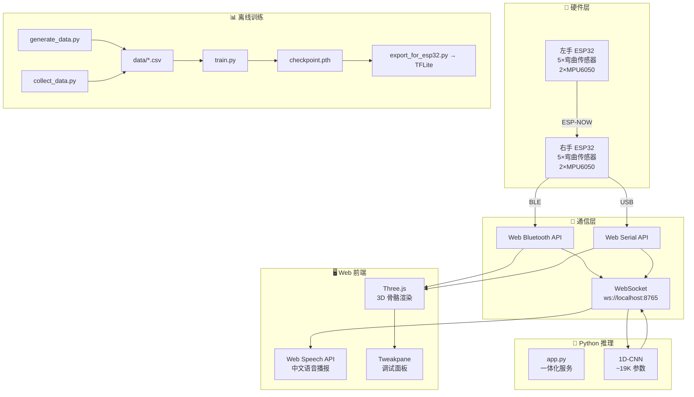
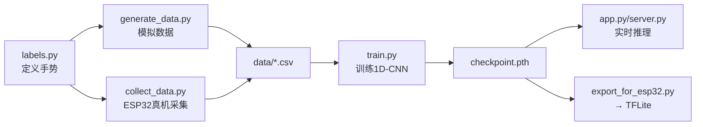

# 🖐️ 手语识别手套 — Sign Language Recognition Gloves

> 基于 **柔性弯曲传感器 + MPU6050 陀螺仪** 的双手机电一体化手语识别系统。  
> 硬件端采集双手十指弯曲度与手腕/小臂姿态数据，通过 **1D-CNN 深度学习** 实时分类，
> 前端基于 Three.js 实现 **3D 手部骨骼姿态可视化**，支持 **蓝牙/串口/WebSocket 三模连接** 与中文语音播报。

<p align="center">
  
  
  
  
  
</p>

---

## 📑 目录

- [项目结构](#-项目结构)
- [系统架构](#-系统架构)
- [硬件组成](#-硬件组成)
- [快速开始](#-快速开始)
- [通信协议](#-通信协议)
- [前端功能](#-前端功能)
- [识别算法](#-识别算法)
- [技术栈](#-技术栈)
- [开发路线](#-开发路线)

---

## 📁 项目结构

```
Sign_Language_Recognition_Gloves/
│
├── Web/                          # 🌐 前端 3D 可视化 + 通信层
│   ├── index.html                #    入口页面 (Three.js 场景容器)
│   ├── main.js                   #    Three.js 场景、GLB 模型加载、骨骼动画驱动
│   ├── serial.js                 #    Web Serial + Web Bluetooth 双模通信与数据解析
│   ├── bluetooth.js              #    Web Bluetooth API + 三级数据滤波(中值/限幅/平滑)
│   ├── websocket_client.js       #    WebSocket 双向通信、识别结果展示
│   ├── voice.js                  #    语音播报模块 (Web Speech API, 右下角圆形按钮)
│   ├── labels.js                 #    标签映射表 (英文→中文: 数字0-10 + 手势词汇)
│   ├── style.css                 #    全局 UI 样式
│   ├── package.json              #    Vite + Three.js + GSAP + Tweakpane
│   ├── hand.glb / righthand.glb  #    左右手 3D 骨骼模型
│   └── device/right/right.ino    #    右手设备固件 (ESP-NOW 主机 + BLE 透传)
│
├── 1dcnn/                        # 🧠 1D-CNN 深度学习训练 + 推理 + 部署
│   ├── labels.py                 # ★ 标签词典 (集中管理：名称/模板/FINGER_MAX/MIN/归一化)
│   ├── cnn.py                    #    HandGestureCNN1D 模型定义 (~19K 参数)
│   ├── train.py                  #    训练脚本 (自动划分/评估/保存最佳模型)
│   ├── data_loader.py            #    数据加载器 (JSON/CSV 双格式)
│   ├── generate_data.py          #    模拟数据生成器 (可调噪声/格式/样本数)
│   ├── collect_data.py           #    ESP32 实时数据采集 (蓝牙BLE / 串口Serial + 监视模式)
│   ├── visualization.py          #    数据可视化 (5种图表: 柱状/对比/热力/箱线/雷达)
│   ├── export_for_esp32.py       #    PyTorch → ONNX → TFLite 模型转换 + C++ 部署代码
│   ├── app.py                    # ★ 一体化 Web 服务 (HTTP + WebSocket, 一键启动)
│   ├── server.py                 #    独立 WebSocket 推理服务
│   ├── requirements_server.txt   #    服务端依赖
│   ├── checkpoint.pth            #    训练好的模型权重
│   └── data/                     #    训练/测试/采集数据集
│
├── Cpp/                          # ⚙️ C++ 向量匹配手势识别 (传统方法)
│   ├── main.cpp / CMakeLists.txt
│   ├── h/ (HandStruct.h / VectorNorm.h / Data_input.h)
│   └── source/ (Data_Record.json / dictionaries.json)
│
├── wlw/                          # 🔧 Arduino 固件与传感器测试工具
│   ├── left/left.ino             #    左手设备固件 (ESP-NOW 从机)
│   ├── MPU6050TEST.ino           #    MPU6050 独立测试
│   └── 蓝牙/ / 快速采样/ / 划分代码/ / base V/
│
└── README.md
```

---

## 🏗️ 系统架构



### 数据流向

| 环节 | 方向 | 协议 | 说明 |
|------|------|------|------|
| 左手 → 右手 | 单向 | ESP-NOW | 左手传感器数据同步到右手主机 |
| 右手 → 前端 | 单向 | BLE / USB Serial | 双手融合数据 JSON 实时传输 |
| 前端 ↔ 后端 | 双向 | WebSocket | 发送12维特征, 接收`{name_cn, confidence, all_probs}` |
| 前端 → 渲染 | 内部 | Three.js | 数据驱动骨骼旋转/屈伸 |
| 前端 → 语音 | 内部 | Web Speech API | 中文朗读 `labels.js` 转译后的结果 |

---

## 🔧 硬件组成

| 组件 | 数量 | 用途 |
|------|:--:|------|
| **ESP32-S3 开发板** | 2 | 主控芯片，数据采集、融合与通信 |
| **柔性弯曲传感器** | 10 | 每指一个，检测弯曲角度 (0~90°) |
| **MPU6050 六轴陀螺仪** | 4 | 每手 2 个，检测手腕与小臂姿态 |
| **分压电阻** | 10 | 与弯曲传感器组成分压电路 |
| **锂电池** | 2 | 分别为左右手设备供电 |

### 传感器数据规范

```
手指弯曲值：0.000 (完全伸直) ←→ 1.000 (完全弯曲)
档位划分： 0(0~20%) 1(20~40%) 2(40~60%) 3(60~80%) 4(80~100%)
手腕姿态：-0.4 ~ 0.4 (MPU6050 互补滤波融合)
```

### 硬件接线

| ESP32-S3 引脚 | 连接 | 说明 |
|:---:|------|------|
| 14,10,18,7,4 | 右手弯曲传感器 | 拇指→小指 |
| 8(SDA),9(SCL) | MPU6050 ×2 | I2C 400kHz |

---

## 🚀 快速开始

### 环境要求

| 工具 | 版本 | 用途 |
|------|------|------|
| Python | ≥ 3.10 | 训练 + 推理服务 |
| PyTorch | ≥ 2.0 | 深度学习框架 |
| Node.js | ≥ 16.x | 前端开发 (Vite) |
| Chrome/Edge | 最新版 | 需 Web Serial/Bluetooth API |
| CMake | ≥ 3.16 | C++ 项目构建 |
| Arduino IDE | ≥ 2.0 | 固件烧录 |

---

### 1️⃣ 一键启动（推荐）

**`app.py` — 单命令启动 HTTP 网页 + WebSocket 推理服务：**

```bash
# 安装依赖
pip install -r 1dcnn/requirements_server.txt

# 启动！自动打开浏览器
python 1dcnn/app.py

# 可选参数
python 1dcnn/app.py --http-port 3000 --ws-port 8766     # 自定义端口
python 1dcnn/app.py --num-classes 3 --threshold 0.6      # 3类手势 + 高阈值
python 1dcnn/app.py --no-browser                         # 不自动开浏览器
```

启动后访问 `http://localhost:8088`，网页自动连接 WebSocket，在网页上连接蓝牙/串口即可实时识别。

> `app.py` 同时提供 HTTP API：`GET /api/status`（服务状态）、`GET /api/shutdown`（远程关闭）。

---

### 2️⃣ 独立 WebSocket 服务 + Vite 前端

想分开跑？也行：

```bash
# 终端1: 启动推理服务
python 1dcnn/server.py --num-classes 3 --threshold 0.5

# 终端2: 启动前端
cd Web && npm install && npm run dev
```

打开 `http://localhost:5173`，前端自动连 `ws://localhost:8765`。

---

### 3️⃣ 1D-CNN 训练管线

```bash
conda activate 1dcnn

# 生成模拟数据 → 训练
python 1dcnn/generate_data.py --samples 300
python 1dcnn/train.py --train 1dcnn/data/train.csv --test_ratio 0.2 --epochs 100 --batch_size 64

# ESP32 真机采集
python 1dcnn/collect_data.py --mode serial --port COM3

# 可视化
python 1dcnn/visualization.py --data 1dcnn/data/train.csv
```

> 📖 详见 [`1dcnn/README.md`](1dcnn/README.md)。

---

### 4️⃣ Arduino 固件烧录

| 设备 | 路径 | 角色 |
|------|------|------|
| 左手 | `wlw/left/left.ino` | ESP-NOW 从机，采集 5 指 + MPU6050 |
| 右手 | `Web/device/right/right.ino` | ESP-NOW 主机，融合双手数据 + BLE 透传 |

**先烧左手，再烧右手** → 上电自动配对。

---

## 🔌 通信协议

### 前端连接方式（3 种）

| 方式 | 协议 | 实现文件 | 特性 |
|------|------|---------|------|
| **蓝牙 BLE** | Nordic UART Service | `serial.js` / `bluetooth.js` | 无线, 三级滤波(中值/限幅/平滑) |
| **USB 串口** | Web Serial API | `serial.js` | 有线, 5 种格式自动识别 |
| **WebSocket** | ws://localhost:8765 | `websocket_client.js` | 双向, 接收推理结果 |

### 数据格式（5 种自动识别）

| 格式 | 示例 |
|------|------|
| 单手 JSON | `{"thumb":0.25,"index":0.50,...,"wrist":0.00}` |
| 双手 JSON | `{"left":{...},"right":{...}}` |
| 标签格式 | `thumb:0.25,index:0.50,...,wrist:0.00` |
| 单手 CSV | `0.25,0.50,0.80,0.30,0.10,0.00` |
| 双手 CSV | `0.25,...,0.00,0.30,...,0.05` (12列) |

### 控制指令

| 指令 | 作用 |
|------|------|
| `FREQ:10/20/50/100` | 切换采样频率 |
| `CAL` | 触发左右手同步校准 |

### WebSocket API

| 方向 | 格式 |
|------|------|
| 客户端→服务端 | `{"features":[12个float]}` 或 `{"left":{...},"right":{...}}` |
| 服务端→客户端 | `{"type":"prediction","label":0,"name":"you","name_cn":"你","confidence":0.95,"all_probs":{...}}` |
| 控制命令 | `{"cmd":"status"}` / `{"cmd":"shutdown"}` |

---

## ✨ 前端功能

| 功能 | 说明 |
|------|------|
| 🦴 **3D 骨骼模型** | GLB 左右手, 五指独立屈伸 + 手腕旋转, GPU 粒子背景 |
| 🔌 **三模连接** | 蓝牙 BLE + USB 串口 + WebSocket, 任意组合 |
| 📡 **实时识别** | 中文手势名 + 置信度百分比 + 全部类别概率分布 |
| 🔊 **语音播报** | Web Speech API 中文朗读, 右下角圆形按钮开关 |
| 🏷️ **标签转译** | `labels.js`: `"you"→"你"` `"good"→"好"` 等 |
| 🔍 **蓝牙滤波** | 中值滤波(窗口5) + 变化率限制(0.15) + 低通平滑(0.3) |
| 📐 **自动校准** | 连接后采集基准值, 完成后面板自动关闭 |
| 🎛️ **调试面板** | Tweakpane: 手指角度/手腕旋转/握拳预设/镜像开关 |
| 🎨 **颜色自定义** | 手部肤色/上衣/背心颜色实时可调 |
| ⚡ **可变采样率** | 10/20/50/100 Hz 四档 |
| 🛑 **远程控制** | 网页端可一键关闭 Python 后端服务 |

---

## 📊 识别算法

### 1D-CNN 模型

```
输入: (batch, 1, 12)        ← 左手6指 + 右手6指

Conv1d(1→32,k=3) → BN → ReLU → MaxPool(2)    # 12 → 6
Conv1d(32→64,k=3) → BN → ReLU → MaxPool(2)   # 6 → 3
Flatten → FC(192→64) → Dropout → FC(64→N_classes)
```

> **~19K 参数**，极轻量，可导出 TFLite 部署到 ESP32。

### 当前手势（3 类）

| label | 英文 | 中文 | 描述 |
|:-----:|------|:--:|------|
| 0 | you | 你 | 右手食指伸直 |
| 1 | good | 好 | 右手拇指弯曲, 其余四指伸直 |
| 2 | meet | 见面 | 右手拇指+无名指+小指伸直 |

> ✏️ **添加新手势**：只需修改 `1dcnn/labels.py` → `GESTURE_NAMES_EN`、`GESTURE_NAMES_CN`、`GESTURE_TEMPLATES` 三处，全局生效。

### 完整训练流程



---

## 🛠️ 技术栈

| 层级 | 技术 |
|------|------|
| **嵌入式** | Arduino C++, ESP32-S3, ESP-NOW, BLE Nordic UART, I2C, MPU6050 |
| **姿态解算** | 互补滤波 (α=0.98) |
| **深度学习** | PyTorch, 1D-CNN, ONNX, TensorFlow Lite |
| **推理服务** | `app.py` (HTTP+WS一体化), `server.py` (独立WS), asyncio + websockets |
| **数据采集** | PySerial, Bleak, Web Serial API, Web Bluetooth API |
| **数据可视化** | Matplotlib (柱状/对比/热力/箱线/雷达图) |
| **前端渲染** | Three.js, GSAP |
| **前端构建** | Vite |
| **调试面板** | Tweakpane |
| **语音播报** | Web Speech API (浏览器原生 TTS) |
| **传统方法** | C++20, CMake, 向量归一化 + 字典匹配 |

---

## 🗺️ 开发路线

### ✅ 已完成

- 弯曲传感器 ADC 采集与五档位划分
- MPU6050 互补滤波姿态解算
- 左右手 ESP-NOW 数据同步
- BLE Nordic UART 透传
- 3D 手部 GLB 模型加载与骨骼动画
- Web Serial / Web Bluetooth 双模 + 5 种格式解析
- 蓝牙三级数据滤波
- WebSocket 识别结果展示 + 中文语音播报
- 标签中英转译
- 1D-CNN 模型训练管线 (生成/采集/训练/可视化/导出)
- **一体化 Web 服务 `app.py`** (单命令 HTTP + WS)
- 网页端远程关闭后端服务
- 传感器归一化 (`labels.py`: FINGER_MAX/MIN, `normalize_finger`)
- C++ 向量归一化字典匹配

### 🚧 进行中

- 更多手语词汇模板 (目标 20+)
- 连续手语语句识别

### 📋 计划中

- ESP32 端侧 TFLite 推理落地
- 移动端 PWA 适配
- 低功耗蓝牙优化
- 训练数据众包采集平台

---

## 📄 License

仅供学习与研究使用。

<p align="center"><sub>Made with ❤️ for accessible communication</sub></p>
