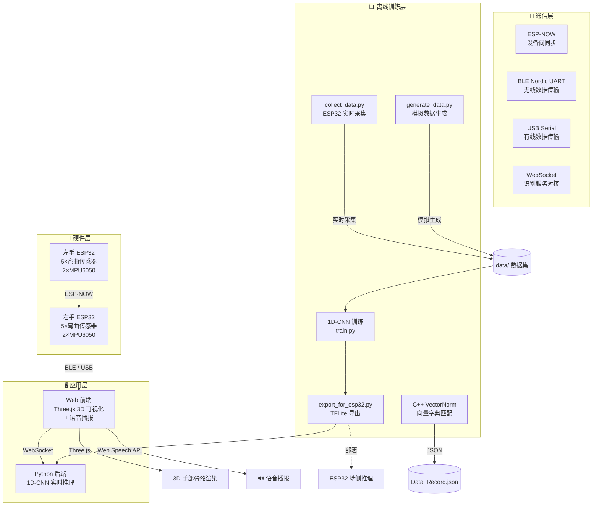
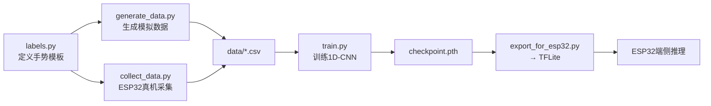

# 🖐️ Sign Language Recognition Gloves — 手语识别手套

> 基于 **柔性弯曲传感器 + MPU6050 陀螺仪** 的双手机电一体化手语识别系统。  
> 硬件端采集双手十指弯曲度与手腕/小臂姿态数据，上位机支持 **C++ 向量匹配** 与 **1D-CNN 深度学习** 两条识别管线，  
> 前端基于 Three.js 实现 **3D 实时手部骨骼姿态可视化**，支持语音播报中文识别结果。

<p align="center">
  
  
  
  
  
</p>

---

## 📑 目录

- [项目结构](#-项目结构)
- [系统架构](#-系统架构)
- [硬件组成](#-硬件组成)
- [快速开始](#-快速开始)
  - [前端 3D 可视化](#1️⃣-前端-3d-可视化)
  - [C++ 向量匹配管线](#2️⃣-c-向量匹配管线)
  - [1D-CNN 深度学习管线](#3️⃣-1d-cnn-深度学习管线)
  - [Arduino 固件烧录](#4️⃣-arduino-固件烧录)
- [通信协议](#-通信协议)
- [前端功能](#-前端功能)
- [识别算法](#-识别算法)
- [技术栈](#-技术栈)
- [开发路线](#-开发路线)

---

## 📁 项目结构

```
Sign_Language_Recognition_Gloves/
│
├── Web/                          # 🌐 前端 3D 可视化 + 通信层
│   ├── index.html                #    入口页面
│   ├── main.js                   #    Three.js 场景、模型加载、骨骼动画驱动
│   ├── serial.js                 #    Web Serial / Web Bluetooth 通信与 5 种格式数据解析
│   ├── websocket_client.js       #    WebSocket 识别结果展示
│   ├── voice.js                  #    语音播报模块 (Web Speech API)
│   ├── labels.js                 #    标签映射表 (英文 → 中文转译)
│   ├── style.css                 #    全局 UI 样式
│   ├── package.json              #    Vite + Three.js + GSAP + Tweakpane
│   ├── temp_patch.txt            #    临时补丁记录
│   ├── public/                   #    静态资源 (GLB 模型等)
│   └── device/
│       └── right/right.ino       #    右手设备固件 (ESP-NOW 主机 + BLE 透传)
│
├── 1dcnn/                        # 🧠 1D-CNN 深度学习手势识别
│   ├── cnn.py                    #    HandGestureCNN1D 模型定义 (Conv1d ×2 + FC ×2)
│   ├── train.py                  #    训练脚本 (一键训练 + 评估 + 保存)
│   ├── data_loader.py            #    数据加载器 (JSON / CSV 双格式)
│   ├── generate_data.py          #    模拟数据生成器 (含噪声)
│   ├── collect_data.py           #    ESP32 实时数据采集 (蓝牙 / 串口双模式)
│   ├── visualization.py          #    数据可视化 (柱状图/对比/热力图/箱线图/雷达图)
│   ├── export_for_esp32.py       #    PyTorch → TFLite 模型转换 & ESP32 部署代码
│   ├── labels.py                 # ★ 标签词典 (修改标签只需改这一个文件)
│   ├── checkpoint.pth            #    训练好的模型权重
│   ├── data/                     #    训练/测试数据集
│   └── README.md                 #    1D-CNN 模块详细文档
│
├── Cpp/                          # ⚙️ C++ 向量匹配手势识别
│   ├── main.cpp                  #    程序入口
│   ├── CMakeLists.txt            #    CMake 构建配置 (C++20)
│   ├── h/
│   │   ├── HandStruct.h          #    双手手势数据结构体 (10指 + 4轴陀螺仪)
│   │   ├── VectorNorm.h          #    向量归一化、特征提取与 JSON 输出
│   │   └── Data_input.h          #    交互式数据录入工具
│   └── source/
│       ├── Data_Record.json      #    训练数据记录
│       └── dictionaries.json     #    手势字典 (标签 → 特征向量映射)
│
├── wlw/                          # 🔧 Arduino 嵌入式固件与测试工具
│   ├── left/left.ino             #    左手设备固件 (ESP-NOW 从机)
│   ├── right/righthand-buletooth #    右手蓝牙版本代码
│   ├── MPU6050TEST.ino           #    MPU6050 独立测试程序
│   ├── 快速采样/                  #    快速 ADC 采样验证
│   ├── 划分代码/                  #    弯曲传感器档位划分算法
│   ├── base V/                   #    基准电压采集与标定
│   └── 蓝牙/                     #    蓝牙 Web 前端 (独立测试)
│       ├── index.html
│       ├── main.js
│       ├── serial.js
│       ├── websocket_client.js
│       ├── bluetooth.js
│       ├── style.css
│       ├── package.json
│       └── README.md
│
└── README.md                     # 📖 本文件
```

---

## 🏗️ 系统架构



### 数据流向说明

| 环节 | 方向 | 协议 | 说明 |
|------|------|------|------|
| 左手 → 右手 | 单向 | ESP-NOW | 左手传感器数据同步到右手主机 |
| 右手 → 前端 | 单向 | BLE / USB Serial | 双手融合数据 JSON 实时传输 |
| 前端 → Python 后端 | 双向 | WebSocket | 发送特征数据，接收识别结果 |
| 前端 → 渲染 | 内部 | Three.js API | 数据驱动 3D 手部骨骼动画 |
| 前端 → 语音 | 内部 | Web Speech API | 中文朗读识别结果 |
| 采集 → 训练 | 离线 | 文件 | `collect_data.py` 生成数据集 → `train.py` 训练模型 |

---

## 🔧 硬件组成

### 核心组件

| 组件 | 数量 | 用途 |
|------|:--:|------|
| **ESP32-S3 开发板** | 2 | 主控芯片，负责数据采集、融合与通信 |
| **柔性弯曲传感器** | 10 | 每指一个，检测手指弯曲角度 (0~90°) |
| **MPU6050 六轴陀螺仪** | 4 | 每手 2 个，分别检测手腕与小臂姿态 |
| **分压电阻** | 10 | 与弯曲传感器组成分压电路，供 ADC 读取 |
| **锂电池** | 2 | 分别为左右手设备供电 |

### 传感器数据规范

```
┌─────────────────────────────────────────────────────┐
│  手指弯曲值：0.000 (完全伸直)  ←→  1.000 (完全弯曲)   │
│  档位划分：  0 (0~20%)  1 (20~40%)  2 (40~60%)      │
│              3 (60~80%)  4 (80~100%)                │
│                                                     │
│  手腕姿态：  -0.4 ~ 0.4 (MPU6050 互补滤波融合角度)    │
│  小臂姿态：  -0.4 ~ 0.4                              │
└─────────────────────────────────────────────────────┘
```

### 硬件接线参考

| ESP32-S3 引脚 | 连接组件 | 说明 |
|:---:|------|------|
| 14, 10, 18, 7, 4 | 右手弯曲传感器 | 拇指→小指 |
| 8 (SDA), 9 (SCL) | MPU6050 ×2 | I2C 总线 (400kHz) |
| 对应左手引脚 | 左手弯曲传感器 | 左手 ESP32 独立连接 |

---

## 🚀 快速开始

### 环境要求

| 工具 | 版本要求 | 用途 |
|------|---------|------|
| **Node.js** | ≥ 16.x | Web 前端开发 |
| **Chrome / Edge** | 最新版 | 需 Web Serial / Bluetooth API |
| **Python** | ≥ 3.10 | 1D-CNN 训练与推理 |
| **PyTorch** | ≥ 2.0 | 深度学习框架 |
| **CMake** | ≥ 3.16 | C++ 项目构建 |
| **C++ 编译器** | C++20 (GCC ≥ 11 / Clang ≥ 14 / MSVC 2022) | C++ 管线编译 |
| **Arduino IDE** | ≥ 2.0 | 固件烧录 |

---

### 1️⃣ 前端 3D 可视化

```bash
cd Web
npm install
npm run dev
```

在浏览器中访问 **`http://localhost:5173`**。

> 💡 无需硬件即可通过 Tweakpane 控制面板手动调参预览 3D 手部动画。

---

### 2️⃣ C++ 向量匹配管线

基于模板匹配的轻量级手势识别，适合字典规模较小的场景：

```bash
cd Cpp
mkdir build && cd build
cmake ..
cmake --build .

# 运行数据录入程序
./hands_see        # Linux / macOS
hands_see.exe      # Windows
```

程序按提示输入手势名称与采集次数，逐帧录入双手手指档位与陀螺仪数据，自动追加写入 `Data_Record.json`，再通过 `VectorNorm.h` 与 `dictionaries.json` 进行向量匹配。

---

### 3️⃣ 1D-CNN 深度学习管线

基于 PyTorch 的端到端手势分类，支持模拟数据快速验证 → 真机采集 → 训练 → 部署完整流程：

```bash
# 激活 Python 环境
conda activate 1dcnn

# Step 1: 生成模拟数据快速验证
python 1dcnn/generate_data.py --samples 200

# Step 2: 训练模型
python 1dcnn/train.py --train 1dcnn/data/train.csv --test_ratio 0.2 --epochs 60

# Step 3(可选): ESP32 实时采集真实数据
python 1dcnn/collect_data.py --mode serial --port COM3
# 摆好手势 → 按 Enter 停止 → 输入标签 → 自动生成 labeled_*.json/csv

# Step 4(可选): 导出 TFLite 部署到 ESP32
python 1dcnn/export_for_esp32.py checkpoint.pth --num-classes 5 --quantize

# Step 5: 数据可视化分析
python 1dcnn/visualization.py --data 1dcnn/data/train.csv
```

> 📖 详细参数与用法见 [`1dcnn/README.md`](1dcnn/README.md)。

---

### 4️⃣ Arduino 固件烧录

| 设备 | 固件路径 | 角色 |
|------|---------|------|
| **左手** | `wlw/left/left.ino` | ESP-NOW 从机，采集 5 指 + MPU6050 |
| **右手** | `Web/device/right/right.ino` | ESP-NOW 主机，融合双手数据 + BLE 透传 |

1. Arduino IDE 安装 ESP32 开发板支持包及所需库 (`Wire`, `WiFi`, `esp_now`, `BLEDevice`)
2. **先烧录左手**，再烧录右手
3. 上电后右手自动通过 ESP-NOW 与左手配对

---

## 🔌 通信协议

### 数据格式（共 5 种）

右手设备通过 BLE / USB 以换行发送，前端 `serial.js` 自动识别：

| 格式 | 示例 | 说明 |
|------|------|------|
| **单手 JSON** | `{"thumb":0.25,"index":0.50,"middle":0.80,"ring":0.30,"pinky":0.10,"wrist":0.00}` | 6 键单侧 |
| **双手 JSON** | `{"left":{...},"right":{...}}` | 左右手独立子对象 |
| **标签格式** | `thumb:0.25,index:0.50,...,wrist:0.00` | 键值对逗号分隔 |
| **单手 CSV** | `0.25,0.50,0.80,0.30,0.10,0.00` | 6 列 |
| **双手 CSV** | `0.25,...,0.00,0.30,...,0.05` | 12 列 → 1D-CNN 直用 |

### 控制指令

| 指令 | 参数 | 说明 |
|------|------|------|
| `FREQ:10` | 10 / 20 / 50 / 100 | 动态切换采样频率 (Hz) |
| `CAL` | — | 触发左右手设备同步校准 |

### WebSocket 接口

| 项目 | 值 |
|------|-----|
| 默认地址 | `ws://localhost:8765` |
| 发送格式 | JSON 手指+陀螺仪特征数据 |
| 接收格式 | `{"detections":[{"label":"你好","confidence":0.95}]}` |

---

## ✨ 前端功能

| 功能 | 说明 |
|------|------|
| 🦴 **3D 骨骼模型** | GLB 左右手骨骼，五指独立屈伸 + 手腕旋转 |
| 🔌 **双模连接** | Web Serial (USB 有线) + Web Bluetooth (BLE 无线) |
| 📐 **自动校准** | 连接后自动采集基准值，完成后面板自动关闭 |
| 📡 **实时识别** | WebSocket 连接后端，显示检测结果与置信度 |
| 🔊 **语音播报** | 识别结果自动中文朗读，可开关 |
| 🏷️ **标签转译** | 英文标签自动映射中文显示 |
| 🎛️ **手动面板** | Tweakpane 独立调节手指角度、手腕旋转、握拳预设 |
| 🪞 **镜像同步** | 左手动作自动映射到右手 |
| 🎨 **颜色自定义** | 手部肤色、衣物颜色实时可调 |
| ⚡ **可变采样率** | 10 / 20 / 50 / 100 Hz 四档 |

---

## 📊 识别算法

项目提供 **两条互补的识别管线**，可根据场景灵活选择：

| 管线 | 算法 | 核心文件 | 适用场景 |
|------|------|---------|---------|
| **C++ 向量匹配** | 特征向量归一化 + 字典查找 | `Cpp/h/VectorNorm.h` | 字典规模小、无需 GPU |
| **1D-CNN 深度学习** | PyTorch Conv1d ×2 + FC ×2 | `1dcnn/cnn.py` | 多类别、高精度、可部署 TFLite |

### 1D-CNN 模型架构

```
输入: (batch, 1, 12)        ← 12维: 左手6指 + 右手6指
       ↓
Conv1d(1→32, k=3) → BN → ReLU → MaxPool(2)    # 12 → 6
       ↓
Conv1d(32→64, k=3) → BN → ReLU → MaxPool(2)   # 6 → 3
       ↓
Flatten → FC(192→64) → Dropout → FC(64→N_classes)
```

> 参数量 **~19K**，极轻量，可导出 TFLite 在 ESP32 端侧运行。

### 1D-CNN 完整工作流



### 预定义手势（5 类）

| label | 英文 | 中文 | 手指状态 |
|:-----:|------|------|----------|
| 0 | open | 张开手掌 | 五指全伸 |
| 1 | fist | 握拳 | 五指全弯 |
| 2 | point | 食指指 | 仅食指伸直 |
| 3 | thumb_up | 点赞 | 仅拇指伸直 |
| 4 | peace | 胜利 V | 食指 + 中指伸直 |

> ✏️ 添加新手势只需修改 `1dcnn/labels.py` 一处，全局自动生效。

---

## 🛠️ 技术栈

| 层级 | 技术 | 说明 |
|------|------|------|
| **嵌入式** | Arduino (C++), ESP32-S3, I2C | 传感器驱动、数据采集、姿态解算 |
| **姿态解算** | 互补滤波 (α=0.98) | 加速度计 + 陀螺仪融合 |
| **设备通信** | ESP-NOW, BLE Nordic UART | 低延迟设备间/设备到主机 |
| **深度学习** | PyTorch, 1D-CNN | 手势分类模型训练 |
| **模型部署** | ONNX, TensorFlow Lite | 导出 ESP32 可用的 TFLite |
| **数据采集** | PySerial, Bleak (Python BLE) | 串口/蓝牙双模式实时采集 |
| **数据可视化** | Matplotlib | 柱状图/热力图/箱线图/雷达图 |
| **前端渲染** | Three.js, GSAP | 3D 骨骼场景、动画过渡 |
| **前端构建** | Vite | 极速 HMR |
| **调试面板** | Tweakpane | 实时参数调节 |
| **前端通信** | Web Serial, Web Bluetooth, WebSocket | 多协议数据通道 |
| **语音播报** | Web Speech API | 浏览器原生 TTS |
| **数据处理** | C++20, CMake | 向量归一化、JSON 序列化 |

---

## 🗺️ 开发路线

### 已完成 ✅

- [x] 弯曲传感器 ADC 采集与五档位划分
- [x] MPU6050 互补滤波姿态解算
- [x] 左右手 ESP-NOW 数据同步
- [x] BLE Nordic UART 透传
- [x] 3D 手部 GLB 模型加载与骨骼驱动
- [x] Web Serial / Web Bluetooth 双模 + 5 种格式解析
- [x] 自动校准 + 可变采样率
- [x] Tweakpane 调试面板 + 颜色自定义
- [x] WebSocket 识别结果展示 + 语音播报
- [x] C++ 向量归一化字典匹配
- [x] 1D-CNN 模型定义与训练 (`cnn.py` + `train.py`)
- [x] 模拟数据生成 (`generate_data.py`)
- [x] ESP32 实时采集工具 (`collect_data.py`)
- [x] 数据可视化 (`visualization.py`)
- [x] PyTorch → TFLite 导出 (`export_for_esp32.py`)
- [x] 标签集中管理 (`labels.py`)

### 进行中 🚧

- [ ] Python WebSocket 后端集成 1D-CNN 实时推理
- [ ] 更多手语词汇模板支持
- [ ] 手势字典自动增量训练

### 计划中 📋

- [ ] ESP32 端侧 TFLite 推理落地
- [ ] 连续手语语句识别
- [ ] 移动端 PWA 适配
- [ ] 低功耗蓝牙优化

---

## 📄 License

仅供学习与研究使用。

---

<p align="center">
  <sub>Made with ❤️ for accessible communication</sub>
</p>
```

### 向量归一化策略

`VectorNorm.h` 将原始 14 维数据（10 指 + 4 陀螺仪）压缩为 **8 维特征向量**：

| 维度 | 含义 | 来源 |
|:--:|------|------|
| 1 | 右手拇指 | finger1 |
| 2 | 右手食指 | finger2 |
| 3 | 右手中/无名/小指均值 | avg(finger3, finger4, finger5) |
| 4 | 左手拇指 | finger6 |
| 5 | 左手食指 | finger7 |
| 6 | 左手中/无名/小指均值 | avg(finger8, finger9, finger10) |
| 7 | 右手手腕角 | gyro1 |
| 8 | 右手小臂角 | gyro2 |
| 9 | 左手手腕角 | gyro3 |
| 10 | 左手小臂角 | gyro4 |

> 三指（中指、无名指、小指）在大部分手语手势中协同运动，因此合并为均值以降低维度。

---

## 🛠️ 技术栈

| 层级 | 技术 | 说明 |
|------|------|------|
| **嵌入式** | Arduino (C++), ESP32-S3, I2C | 传感器驱动、数据采集、姿态解算 |
| **姿态解算** | 互补滤波 (α=0.98) | 加速度计 + 陀螺仪数据融合 |
| **设备通信** | ESP-NOW, BLE (Nordic UART) | 低延迟设备间/设备到主机通信 |
| **前端渲染** | Three.js, GSAP | 3D 骨骼场景、动画过渡 |
| **前端构建** | Vite | 极速 HMR 开发体验 |
| **调试面板** | Tweakpane | 实时参数调节 |
| **数据处理** | C++20, CMake | 向量归一化、JSON 序列化 |
| **实时通信** | Web Serial, Web Bluetooth, WebSocket | 多协议数据通道 |

---

## 🗺️ 开发路线

### 已完成 ✅

- [x] 弯曲传感器 ADC 采集与五档位划分
- [x] MPU6050 互补滤波姿态解算
- [x] 左右手 ESP-NOW 数据同步
- [x] BLE Nordic UART 透传
- [x] 3D 手部 GLB 模型加载与骨骼驱动
- [x] Web Serial / Web Bluetooth 双模通信
- [x] 5 种串口数据格式自动识别（JSON / 标签 / CSV / 双手 CSV）
- [x] 自动校准流程
- [x] 语音播报模块（Web Speech API）
- [x] 标签中英文映射表
- [x] C++ 手势数据结构与向量归一化
- [x] Tweakpane 调试面板
- [x] WebSocket 识别结果展示

### 进行中 🚧

- [ ] Python 后端手语识别模型对接
- [ ] 手势字典自动匹配与增量训练
- [ ] 更多手语词汇支持

### 计划中 📋

- [ ] 实时手势录制与回放
- [ ] 手语连续语句识别
- [ ] 移动端 PWA 适配
- [ ] 低功耗蓝牙优化

---

## 📄 License

本项目仅供学习与研究使用。

---

<p align="center">
  <sub>Made with ❤️ for accessible communication</sub>
</p>
