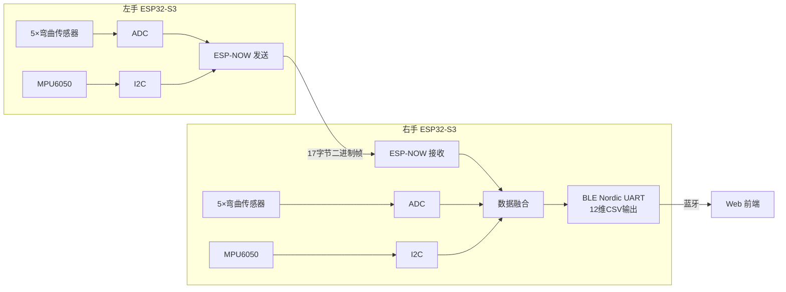

# 🔧 Arduino 嵌入式固件 — ESP32 双手手套

左右手 ESP32-S3 固件，负责传感器数据采集、ESP-NOW 设备间同步、BLE 透传至前端。

---

## 📁 项目结构

```
wlw/
├── left/             # 左手设备固件
│   ├── left.ino      #   ESP-NOW 发送端：采集 5 指 + MPU6050 → 发至右手
│   ├── debug.cfg     #   OpenOCD 调试配置
│   └── debug_custom.json
│
├── right/            # 右手设备固件
│   ├── right.ino     #   ESP-NOW 接收端 + BLE 主机：融合双手数据 → 蓝牙输出
│   ├── debug.cfg
│   └── debug_custom.json
│
└── README.md
```

---

## 🏗️ 设备角色



---

## 📡 通信协议

### ESP-NOW 帧格式（左手 → 右手）

| 字段 | 字节 | 说明 |
|------|:--:|------|
| 帧头 | 1 | `0xAA` |
| 版本号 | 1 | 当前为 1 |
| 数据类型 | 1 | `0x01`=传感器数据, `0x02`=校准指令, `0x03`=心跳 |
| 拇指~小指 | 5 | 各 1 字节，0~100% |
| 手腕角度 | 2 | 小端, 范围 -400~400 (÷1000) |
| 数据包序号 | 2 | 小端, 递增 |
| CRC16 | 2 | CRC16-CCITT |
| 帧尾 | 1 | `0x55` |
| **总计** | **17** | |

### BLE 输出格式（右手 → 前端）

```
L_thumb,L_index,L_middle,L_ring,L_pinky,L_wrist,R_thumb,R_index,R_middle,R_ring,R_pinky,R_wrist
```

12 个逗号分隔的浮点数，通过 **Nordic UART Service (NUS)** 以换行分隔发送，可直接用于 1D-CNN 推理。

### 串口指令

| 指令 | 作用 |
|------|------|
| `FREQ:10/20/50/100` | 切换采样频率 (Hz) |
| `CALIBRATE` | 开始校准 |

---

## 🔌 烧录步骤

### 环境要求

- **Arduino IDE** ≥ 2.0
- **ESP32 开发板支持包** (通过 Boards Manager 安装)
- 所需库：`Wire.h`, `WiFi.h`, `esp_now.h`, `BLEDevice.h`, `BLEUtils.h` 等（通常 ESP32 包自带）

### 烧录

1. 用 USB 线连接左手 ESP32-S3
2. Arduino IDE 打开 `left/left.ino`，选择对应端口和开发板 (ESP32-S3 Dev Module)
3. 点击上传
4. **左手烧录完成后拔掉**，连接右手 ESP32-S3
5. 打开 `right/right.ino`，选择对应端口，上传
6. 两台设备上电 → 右手自动通过 ESP-NOW 配对左手

> ⚠️ **必须先烧录左手再烧录右手。** 右手设备启动后发送就绪心跳 `0x03` 通知左手自己的 MAC 地址，若左手未先启动则接收不到。

---

## 🔧 硬件接线

### 左手 / 右手（各自相同）

| ESP32-S3 引脚 | 连接 | 说明 |
|:---:|------|------|
| 14 | 拇指弯曲传感器 | ADC 读取 |
| 10 | 食指弯曲传感器 | ADC 读取 |
| 18 | 中指弯曲传感器 | ADC 读取 |
| 7 | 无名指弯曲传感器 | ADC 读取 |
| 4 | 小指弯曲传感器 | ADC 读取 |
| 8 (SDA) | MPU6050 SDA | I2C 数据 |
| 9 (SCL) | MPU6050 SCL | I2C 时钟 |

---

## 🛡️ 可靠性设计

| 机制 | 说明 |
|------|------|
| **CRC16 校验** | 每帧带 CRC16-CCITT，右手接收后校验，错误丢弃 |
| **重发机制** | 发送失败最多重试 3 次 |
| **发送队列** | 16 帧环形缓冲，匹配高达 100Hz 采样 |
| **心跳检测** | 右手定期发送 `0x03` 就绪心跳通知左手在线 |
| **校准同步** | 右手发送 `0x02` 指令触发左手同步校准 |

---

## 📄 License

仅供学习与研究使用。
